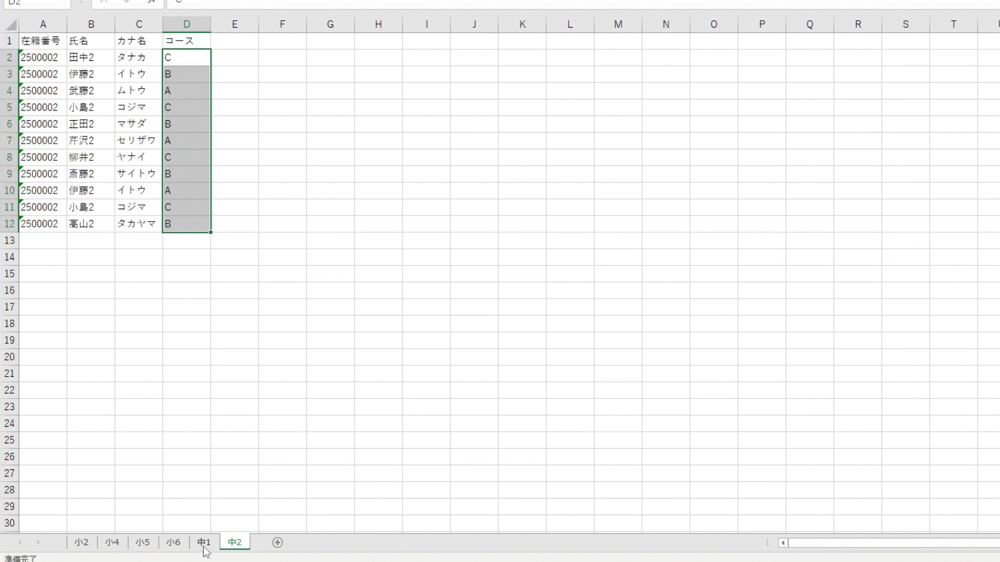

# 自習室管理アプリケーション

## 環境構築

pythonで実行する際、以下の環境が必要です

```python
pip install openpyxl
```

## 実行方法

* python で実行する際

```bash
python ListBox_tk.py
```

* exe で実行する際
  * 以下をクリックして実行

```bash
SeatManage.exe
```

## 主な仕様について

以下、主な仕様について紹介します。

### 座席管理について

席のボタンを押すことで座席を取得できます。


これはアプリケーションを落とし再度起動した場合、状態に変化はありません。


座席を空ける際、再度赤いボタンを押します。その後、勉強時間が表示されます。


### データの管理について

座席を取得した際、ログを保存しています。

* Excel で管理しているため、PC に詳しくない方でも操作可能かと思います。

生徒名簿も同様に Excel での管理を行っています。

* フォーマットに従って登録して下さい。



## EXE 化作成コマンドについて

```bash
pyinstaller ./ListBox_tk.py --onefile --icon="../image/python_LOGO.ico" --noconsole --name="SeatManage" --hidden-import="openpyxl,pkg_resources.py2_warn,importlib"
```
