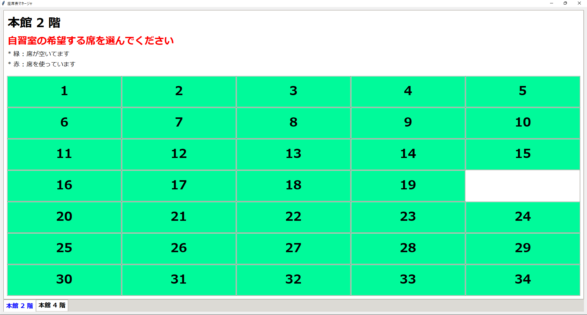

# 自習室管理アプリケーション

## 移行後のアプリの様子

以下のような形に置き換える



## TODO リスト

* [ ] GUI を HTML/CSS/JavaScript ベース(EEL モジュール使用)に置換する
* [ ] 簡単に座席の配置を変更できるようにする
* [ ] ログファイルの統合機能を追加する

## 参考資料

* [【実用】WindowsのPythonからSQLiteを使う](https://resanaplaza.com/2021/06/22/%E3%80%90%E5%AE%9F%E7%94%A8%E3%80%91windows%E3%81%AEpython%E3%81%8B%E3%82%89sqlite%E3%82%92%E4%BD%BF%E3%81%86/)
* [python - データベースをexeファイルに含めることができません](https://tutorialmore.com/questions-1575746.htm)

## 環境構築

pythonで実行する際、以下の環境が必要です

```sh
pip install -r requirements.txt
```

## 主な仕様について

以下、主な仕様について紹介します。

### 座席管理について

席のボタンを押すことで座席を取得できます。


これはアプリケーションを落とし再度起動した場合、状態に変化はありません。


座席を空ける際、再度赤いボタンを押します。その後、勉強時間が表示されます。


### データの管理について

座席を取得した際、ログを保存しています。

* Excel で管理しているため、PC に詳しくない方でも操作可能かと思います。

生徒名簿も同様に Excel での管理を行っています。

* フォーマットに従って登録して下さい。


## EXE 化作成コマンドについて

```bash
pyinstaller ./ListBox_tk.py --onefile --icon="../image/python_LOGO.ico" --noconsole --name="SeatManage" --hidden-import="openpyxl,pkg_resources.py2_warn,importlib"
```
